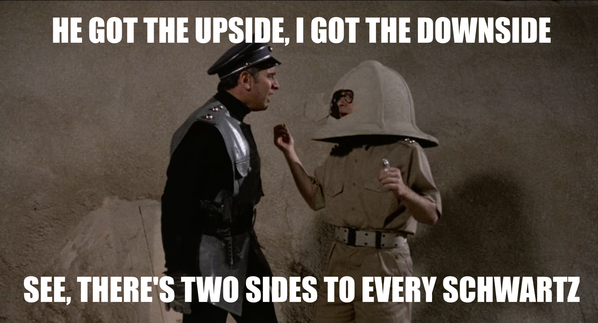
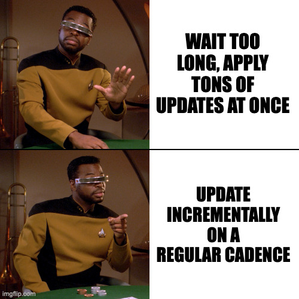

<!-- .slide: class="title-slide" data-hide-footer -->
# Up to my Eyeballs in Technical Debt!

Steve Grunwell <!-- .element: class="byline" -->
[@stevegrunwell@phpc.social](https://phpc.social/@stevegrunwell)
[stevegrunwell.com/slides/technical-debt](https://stevegrunwell.com/slides/technical-debt)

---

## Understanding Technical Debt

Note:

Before we can address technical debt, we should understand what we're talking about

----

### What is Technical Debt?

Challenges resulting from past decisions to favor <u>speed, simplicity, or cost</u> over<br><u>quality, maintainability, or robustness</u>

Note:

Ask 100 different engineers and you'll (somehow) get 104 different definitions of technical debt.

For the sake of the talk today, we're going to define technical debt thusly.

----

#### So you've settled on React&hellip;

<dl class="centered">
    <dt class="fragment" data-fragment-index="0">Pros</dt>
    <dd class="fragment" data-fragment-index="0">Tons of docs, libraries, etc.</dd>
    <dd class="fragment" data-fragment-index="1">Popular framework == large hiring pool</dd>
    <dt class="fragment" data-fragment-index="2">Cons</dt>
    <dd class="fragment" data-fragment-index="2">Need to keep up with the React ecosystem</dd>
    <dd class="fragment" data-fragment-index="3">Beholden to decisions of Meta</dd>
</dl>

Note:

Keep in mind that technical debt doesn't just mean "bad" or "legacy" code: right now your front-end team might be deciding to move to React, and that comes with pros and cons

----

#### Technical Debt is a Part of Life

* <!-- .element: class="fragment" --> Mo' features, mo' problems
* <!-- .element: class="fragment" --> No code is 100% maintenance-free<br>(so pick your battles)

Note:

* In the grand scheme of things, you can't have software without incuring some debt
* The real challenge is getting the maximum benefit with minimal downside

----

#### Software is all about trade-offs

 <!-- .element: style="max-height: 40vh;" -->

Note:

Ultimately, software is all about trade-offs:

- do we do it fast, or do we do it right?
- is it worth the time/effort to replace this?
- is fixing this worth the potential risks?

----

### Technical Debt in the Real World

Success + Tech Debt are not mutually exclusive!

* <!-- .element: class="fragment" --> Banking systems still running COBOL
* <!-- .element: class="fragment" --> WordPress: ~43% of web, "compatible with exceptions" for PHP 8.x
* <!-- .element: class="fragment" --> Services on outdated servers/dependencies
* <!-- .element: class="fragment" --> Work-arounds for <abbr title="High-Value Customers">HVCs</abbr>
* <!-- .element: class="fragment" --> "Legacy" applications

Note:

Technical debt is everywhere:

* Many financial institutions still run on software written decades ago in COBOL, because the cost + risk of replacing these systems is so high
    - Cheaper to pay handsome saleries to mainframe devs
* WordPress, by far the most popular PHP-based CMS, powers roughly 43% of the web (according to W3Techs)
    - Only "beta" support for PHP 8.2 + 8.3, is "compatible with exceptions" for PHP 8.0 + 8.1
    - Part of the market strategy is making it easy to run WordPress _anywhere_, and cheap hosts aren't usually current on PHP
* Services you use every day, perhaps even to power your business, are often running outdated server software, dependencies, etc.
    - Opportunity cost: what value could those engineers be driving instead of constantly updating?
* Any time a high-value customer needs something to work a little differently and a dev drops in a conditional
* So-called "legacy" applications that still bring in millions in revenue

----

### Technical Debt is a Slow Boil

Note:

If technical debt is a part of life and isn't inherently bad, why are we talking about it?

The problem is when the tech debt piles up and inhibits your team.

----

### Signs You May Be In Debt

1. <!-- .element: class="fragment" --> Even small changes are highly-involved
2. <!-- .element: class="fragment" --> Frequent incidents & outages
3. <!-- .element: class="fragment" --> Increased attrition
4. <!-- .element: class="fragment" --> Maintainers stop providing patches
5. <!-- .element: class="fragment" --> Archive.org becomes your doc site

Note:

1. Even small changes like adding a button or updating copy takes hours (or more)
    * New features are nearly-impossible (or end up being written as entirely-separate services)
2. You're constantly fighting fires due to things breaking
3. Your top engineers are looking for new jobs
    * Even your IDE wants to quit
    * Worse yet, the toxic dev who wrote this 10 years ago and is the only one who understands it is the only one sticking around because "job security"
4. You have more EOL dependencies than supported ones
5. The docs for your library versions are so old you have to visit the Internet Archive to reach them

Common mainfestations of bad technical debt include:

----

<!-- .slide: class="has-background-image" data-background="resources/spaghetti.jpg" data-background-size="cover" data-background-opacity="40%" -->

#### Spaghetti Code

Note:

* Code that's difficult to navigate through, like a big plate of spaghetti
* Often the result of poorly thought-out or ever-changing business requirements
    - Causes developers to waste a lot of time sorting things out
    - Difficult to onboard into
    - Breeding ground for tough-to-track-down bugs

----

#### Committed libraries

```sh
# Make life harder with this one dumb trick!
curl -O https://example.com/some-package.zip \
    && unzip some-package.zip -d lib/some-package \
    && rm some-package.zip \
    && git add lib/some-package \
    && git commit -m "I'm creating debt!!🙃"
```

Note:

* lib/ directories and similar, full of third-party code **not** managed by a tool like Composer
* Congratulations, you've effectively adopted that dependency!
    - Updates, conflicts, patches, and bugs are now your responsibility
* When possible, you want to use an appropriate package manager

----

#### @todo comments

```php
/**
 * @todo WTF is going on here?! 😱
 */
```

Note:

* `@todo` comments aren't inheriently-evil, but can be good indicator of incomplete/buggy code
* Try to be as descriptive as possible; can this be linked to a Jira ticket or something?

----

<!-- .slide: class="has-background-image" data-background-image="resources/trogdor.jpg" data-background-position="center bottom" data-background-repeat="no-repeat" data-background-color="#fff" data-background-size="contain" -->

#### Here be Dragons

Note:

* Another comment you don't want to see
    - I don't know why this works, it just does
    - Dear, sweet Jeebus, be careful!
* Black boxes: where data goes in and comes out, but nobody's sure _how_ it works

----

#### Useless Tests

* <!-- .element: class="fragment" --> Describe the behavior, not the implementation
* <!-- .element: class="fragment" --> Too many mocks (including the SUT!)
* <!-- .element: class="fragment" --> Asserting that *any* exception is thrown
* <!-- .element: class="fragment" --> Loose comparisons (e.g. `false == null`)

Note:

Bad tests can sometimes be worse than no tests at all!

* When people are just learning how to test (or worse, are told "you must have tests for everything" without guidance), they often fall into the trap of testing the implementation, not the intended behavior
    * Basically just writing the code twice, which defeats the purpose
* Tests that mock *everything*, including SQL queries or even the method we're trying to test
* Tests that expect that an exception—any exception—is thrown
    * Becomes a problem when the exception you're catching isn't what you were expecting
* Tests that use `assertEquals()` (loose comparison) for everything and don't know the difference between a false or null return (which could have very different meanings)

----

#### Brittle Tests

```diff [|1|2-7]
- echo '<ul class="items"><li>Item 1</li><li>Item 2</li></ul>';
+ echo <<<'HTML'
+     <ul class="items">
+         <li>Item 1</li>
+         <li>Item 2</li>
+     </ul>
+     HTML;
```
<!-- .element: class="hide-line-numbers" style="font-size: .5em;" -->

Note:

Let's say you have a function that prints out an unordered list of items, and you have a test that verifies we see this list.

If your test fails because the formatting of the markup changed, then this test is too brittle and can actually impede progress!

----

#### Branching for special cases <!-- .element: class="screen-reader-text" -->

![Four panel comic from Commit Strip. In the first panel, the developer tells the Product Manager "No. Just No." as the PM pleads "Come on...only one small exception". Panel two continues, with the developer stating "It's a self-service SaaS, we can't handle individual requests" while the PM reasons "Come on...just a tiny IF. A ridiculously tiny IF...". In panel three, the PM continues "It's one of our biggest customers...I'll owe you one!". The developer hesitates, saying "I shouldn't...". In panel four, set later, the Database Engineer asks the dev "Where you do you manage clients' special requests", to which the dev responds defeatedly "model/clients.php. There's a switch with 145 cases, just add yours".](resources/commitstrip-exceptions.jpg) <!-- .element: style="max-height: 55vh;"-->

Note:

If your codebase is full of one-off "well, this particular customer requires this extra thing be enabled" branches, it becomes far more difficult to keep everything straight

Worse yet, these rarely have appropriate tests, meaning when one of these one-off fixes breaks it's often for high-value customers.

Ideally, these would be defined as attributes or feature flags that you can assign to individual customers.

----

#### Dead Code


Note:

* Sometimes it can be really hard to say goodbye to code that we wrote, even if it's no longer necessary
    * Version 2 is live, but nobody removed v1 after launch
    * Code that's outlived its usefulness: One-time migration scripts, COVID-19 promos, etc.
* Thanks to version control, dead code's never truly gone (but it doesn't need to be cluttering up your repo)

---

## Technical Debt<br>Repayment Plan

Note:

* You just joined a new team with a large, legacy codebase serving millions of users
* Can't just throw everything away and start over, so where do you start?

----

### Define scope

* <!-- .element: class="fragment" -->What are we hoping to solve?
* <!-- .element: class="fragment" -->Why do we want to do this?
* <!-- .element: class="fragment" -->What's our ideal state?
* <!-- .element: class="fragment" -->How will we address this?
* <!-- .element: class="fragment" -->How do we measure success?

Note:

Jumping right in without a strategy is likely how the app ended up with all this debt, so let's be smarter as we fix things

1. What is it that we're trying to solve? Replace an old library? Untangle a complex web?
2. Why are you tackling this? Performance? Is it a security risk? A pain point for users or your team?
3. What's the ideal state? Where do you hope to be after this?
4. How do you get from A to B? What needs to happen?
5. How will you measure success?

----

### Example: Upgrade to PHP 8

Note:

Here's an example that will probably resonate: upgrading your app so it runs on PHP 8.

----

#### Why do we want to do this?

* <!-- .element: class="fragment" --> PHP 8 is more powerful and faster
* <!-- .element: class="fragment" --> PHP 7.x is EOL (security risk)
* <!-- .element: class="fragment" --> Packages dropping 7.x support

Note:

So we want to upgrade, but why?

* PHP 8 has a lot of powerful new features and can be more performant
* PHP 7.x is EOL, so we won't get new security patches
* Packages we rely on are dropping PHP 7.x support, so we won't get new features or patches

----

#### What's our ideal state?

* <!-- .element: class="fragment" --> All app servers are running PHP 8.3
* <!-- .element: class="fragment" --> Composer dependencies are updated<br>to their latest versions
* <!-- .element: class="fragment" --> No impact to application behavior

Note:

Just because we're going to PHP 8 doesn't mean we have to use all of its features on day one.

Notice we didn't mention anything about, for example, ripping out that old enum library and using PHP's native enums. One thing at a time!

----

#### How will we address this?

1. <!-- .element: class="fragment" --> Install/upgrade static code analysis tools
2. <!-- .element: class="fragment" --> Resolve issues caught by static code analysis
3. <!-- .element: class="fragment" --> Resolve issues surfaced by test suite(s)
4. <!-- .element: class="fragment" --> Pre-prod testing w/ PHP 8.3
5. <!-- .element: class="fragment" --> Slow roll out 8.3 image across hosts
6. <!-- .element: class="fragment" --> Clean up PHP 7.x leftovers

Note:

Now we know what we're hoping to accomplish, so now we need to determine how we get there

1. If we already have a static code analysis tool, make sure it's current.
    * If not, now would be a good time to install one
2. Tell the tool that we're targeting PHP 8 and let it tell us where we might have issues
3. Next, get the tests running on PHP 8
    * Good test suites will cover large portions of the app
    * No tests? This would be a very good time to start!
4. Next, we want to manually test things
    * If you have a QA team, they'll be vital here
    * Involve SMEs to ensure things continue to work as expected
5. Finally, start rolling out PHP 8 on production
    * If possible, don't upgrade all servers at once
6. Once you're on PHP 8, clean up any PHP 7-specific paths you may have added

----

#### How do we measure success?

1. <!-- .element: class="fragment" --> All app servers are running PHP 8.3
2. <!-- .element: class="fragment" --> All Composer dependencies are up-to-date
3. <!-- .element: class="fragment" --> No unscheduled downtime or production errors related to upgrade

Note:

You may notice, a lot of these metrics match our described, ideal state

---

## Strategies for Paying Down Technical Debt

Note:

As you've seen, the first step in addressing technical debt is identifying where it exists.

Now let's talk about strategies for removing some of this technical debt.

----

### Start with Regression Tests!

* <!-- .element: class="fragment" --> Write tests that capture existing behavior
* <!-- .element: class="fragment" --> Ensures that as you make changes the app still does what it needs to do
* <!-- .element: class="fragment" --> Focus on higher-level, end-to-end tests
* <!-- .element: class="fragment" --> Continuous Integration FTW!

Note:

* Best place to start is capturing current behavior with tests
* Doesn't need to cover everything, but critical flows (signup, login, payments, etc.)
* Don't get wrapped up in all of the implementation details; e2e tests for critical paths
* These tests should be run as part of your CI pipeline on every push
    * Don't have a CI pipeline? No time like the present!

----

### Static Code Analysis

* <!-- .element: class="fragment" --> Inspect your code without running it
    * [PHPStan](https://phpstan.org), [Phan](https://github.com/phan/phan), [Psalm](https://psalm.dev/)
* <!-- .element: class="fragment" --> Find type + logical errors
* <!-- .element: class="fragment" --> Tune it to avoid a firehose!

Note:

* Static code analysis is a method of analyzing your code without having to run it
* Great at catching logical errors, type issues, etc.
* Many can also help you identify dead code paths

----

#### Tuning Static Code Analysis

1. <!-- .element: class="fragment" --> Unknown classes/functions/methods, wrong number of args, etc.
2. <!-- .element: class="fragment" --> Potentially undefined vars, invalid PHPDocs
3. <!-- .element: class="fragment" --> Unreachable code, conditionals that will always pass/fail
4. <!-- .element: class="fragment" --> Strict types, etc.

Note:

* Most static code analysis tools let you dial in the things you care about
* If you're just introducing static code analysis, start with the lowest level and, as you address (or suppress) issues, you can turn this up (learn to crawl before you can learn to walk)

----

### Leverage Package Managers

* <!-- .element: class="fragment" --> Manage dependencies through package manager(s) (Composer, npm, etc.)
* <!-- .element: class="fragment" --> Handles intermediary dependencies
* <!-- .element: class="fragment" --> Negotiates version constraints, conflicts

Note:

* If you find that your app has a bunch of committed third-party dependencies (lib/ directory or similar), try to get these into a package manager like Composer
    * Easy for these to fall out of date and often the upgrade path is not clear
    * If possible, determine which version you're currently using and install it via package manager instead
* Package managers handle intermediary dependencies, especially those that might be shared across packages
* They also flag version conflicts and constraints

----

#### Composer in Action

```sh [1|2]
$ composer why-not php 8.3
some-vendor/some-old package 1.2.3 requires php (^7.0)
```
<!-- .element: class="hide-line-numbers" -->

```sh
$ composer require "php:8.3" --dry-run
```
<!-- .element: class="fragment" -->

Note:

* Composer can tell us which of our dependencies don't claim to support PHP 8.3
* For even further details, you can run `composer require php:8.3` with the `--dry-run` flag and see what conflicts Composer has flagged

----

### Adapter Pattern

* <!-- .element: class="fragment" --> Define an interface, then write library-specific implementations
* <!-- .element: class="fragment" --> Makes it easier to swap out underlying libraries with minimal interruption
* <!-- .element: class="fragment" --> Easy to over-do, don't abstract things prematurely!

Note:

* Whether adding new or updating existing dependencies, consider wrapping them in an adapter that you control
    * Helps decouple your app code from the underlying libraries, but only if you call your interface methods rather than the library directly!!
* Makes it easier to change the underlying library or sort out differences between versions in one spot
    * You can also test individual implementations more-easily
* Use your judgement when this might make sense to use: how likely are you to really swap out Monolog?

----

#### Adapter Pattern & Better Coffee

```php [|5|6]
use BlamCo\InstantCoffee;

function brewCoffee()
{
    $coffee = new InstantCoffee();
    $coffee->percolate(/* ... */);
}
```
<!-- .element: class="hide-line-numbers" -->

Note:

Let's say your app has a bunch of calls like this to brew instant coffee:

You've been using this for years, but the InstantCoffee package doesn't support PHP and everyone's complaining that it tastes like dishwater.

How can we swap this out so that our various brewCoffee methods can brew better coffee?

----

#### The BeverageInterface

```php [|3-5,8]
namespace MyApp\Beverages;

interface BeverageInterface
{
    public function prepare(): void;

    /* You might also have serve(), drink(), etc. */
}
```
<!-- .element: class="hide-line-numbers" -->

Note:

First, we define the BeverageInterface, which contains methods for anything we might need to do with a beverage.

This is abbreviated to fit on a slide, but we might have methods like prepare, serve, drink, etc.

----

#### Adapter for the old <!-- .element: class="screen-reader-text" -->

```php [5,15|11-14|7-9]
namespace MyApp\Beverages;

use BlamCo\InstantCoffee;

class InstantCoffeeAdapter implements BeverageInterface
{
    public function __construct(
        private InstantCoffee $coffee
    ) {}

    public function prepare(): void
    {
        $this->coffee->percolate(/* .. */);
    }
}
```
<!-- .element: class="hide-line-numbers prevent-scroll" -->

Note:

Next, we'll define an adapter that implements this interface for our `InstantCoffee`.

This just moves what we were doing in our `brewCoffee()` method earlier into the prepare method.

We could also define whatever protected/private methods we might need, but the `prepare()` method is how the app will interact with this class.

Notice that we're using constructor property promotion to define the `$coffee` property, which is an instance of `InstantCoffee`.

----

#### Adapter for the new <!-- .element: class="screen-reader-text" -->

```php [5,15|7-9|11-14]
namespace MyApp\Beverages;

use GoodCoffeeCo\WholeBeanCoffee;

class GoodCoffeeAdapter implements BeverageInterface
{
    public function __construct(
        private WholeBeanCoffee $coffee
    ) {}

    public function prepare(): void
    {
        $this->coffee->grind()->brew();
    }
}
```
<!-- .element: class="hide-line-numbers prevent-scroll" -->

Note:

Now we'll do the same for our `WholeBeanCoffee` from Good Coffee Co.

We're injecting an instance of `WholeBeanCoffee` via the constructor, then our prepare method is calling the grind and brew methods on that instance.

It doesn't matter what we're doing inside `prepare()` as long as it satisfies the contract defined by the interface.

----

#### Determining what to brew <!-- .element: class="screen-reader-text" -->

```php [|9-14]
namespace MyApp\Beverages;

use BlamCo\InstantCoffee;
use GoodCoffeeCo\WholeBeanCoffee;
use MyApp\FeatureFlags;

class HotBeverageFactory
{
    public function getCoffee(): BeverageInterface
    {
        return (FeatureFlags::isOn('use_good_coffee'))
            ? new GoodCoffeeAdapter(new WholeBeanCoffee());
            : new InstantCoffeeAdapter(new InstantCoffee());
    }
}
```
<!-- .element: class="hide-line-numbers prevent-scroll" -->

Note:

Now we need a way to determine which type of coffee to make: good coffee or instant coffee.

If we have a DI container, we could put this logic in there. For the sake of simplicitly, we'll define a `HotBeverageFactory` that has a `getCoffee()` method that, depending on the value of hte "use_good_coffee" feature flag, will return one of the two adapters.

Notice that we're using a return type of BeverageInterface: it doesn't matter _which_ coffee adapter we use, we're returning something that implements that interface.

----

#### Brewing our Coffee

```diff [1,6-7|2,8-9]
- use BlamCo\InstantCoffee;
+ use MyApp\Beverages\HotBeverageFactory;

  function brewCoffee()
  {
-     $coffee = new InstantCoffee();
-     $coffee->percolate(/* ... */);
+     // We don't care what kind, the adapters handle this!
+     HotBeverageFactory::getCoffee()->prepare();
  }
```
<!-- .element: class="hide-line-numbers" -->

Note:

Finally, we're brewing our coffee. If we revisit our `brewCoffee()` method from earlier and replace the references to `InstantCoffee()` with our new factory method.

We'll do this anywhere that we were manually constructing `InstantCoffee`.

Now, if we decide to switch from Good Coffee Co to **Great** Coffee Co, it's just a matter of writing a new adapter and updating our factory method (or DI container, if we went that route)

----

### Backfill Documentation


Note:

* As you begin digging into the old, crusty code don't be afraid to take notes on your findings!
    * Remember to capture not only the how, but the _why_!
* Documentation-only PRs are not only very low-risk, but also help you and other members of your team follow along.
* Adding docblocks also helps static code analysis tools better analyze your code

----

### [Rector](https://github.com/rectorphp/rector)

* <!-- .element: class="screen-reader-text" --> "Automated Refactoring" using the PHP AST
* <!-- .element: class="screen-reader-text" --> Not a magic bullet!
* <!-- .element: class="screen-reader-text" --> Best paired with automated coding standard fixers
    * [h/t Andy Snell](https://github.com/andysnell/downgrade-to-upgrade)

Note:

* Cool tool I haven't gotten to work with much (yet)
* Uses Nikita's PHP-Parser library to construct an Abstract Syntax Tree (AST), then apply a series of transformations ("rectors") to the code
* Not magic: the messier the code, the less effective it will be
* Note that this will not necessarily respect your coding standards, so best to pair with something like PHP Code Beautifier (phpcbf) or PHP Coding Standards Fixer

---

## Preventing Technical Debt

Note:

Some strategies that we can use to avoid taking on a ton of technical debt in the first place

----

### Recognize Trade-offs

How likely is it that taking the easy way now will bite us later?

Note:

* As mentioned earlier, software is all about trade-offs
* Remember: not all code is meant to last forever; be intentional about new debt

----

### Code review

Just Do It.

Note:

* If it isn't already, make code review a required part of your team's development.
* Not only does it help catch bugs before they reach production, but it ensures you're not the only one who understands how the app works.
* This includes documentations: if a PR changes the way something works it must also include the relevant documentation updates!

----

### Embrace Coding Standards

A good codebase reads like it was written by a team that was on the same page.

Note:

* Coding standards help keep the codebase organized and readable
* Not just spaces v. tabs, but procedural v. OOP, namespaces, organization, etc.
* Enforce standards with tools like PHP_CodeSniffer and PHP Coding Standards Fixer

----

### Write tests as you go

* <!-- .element: class="fragment" --> Test-Driven Development
* <!-- .element: class="fragment" --> Red - Green - Refactor
* <!-- .element: class="fragment" --> Regression tests

Note:

Big topic that I've given multiple talks on, but be sure that you're writing tests as you go!

* When adding a feature, write tests first to describe how it should behave
* These will fail since you haven't written the code (red). Implement the feature until the tests pass (green), and then clean-up (refactor)
* When fixing bugs, start by reproducing them with tests
    * Helps protect against future regressions

----

### Plan for updates



Note:

Remember that technical debt is a slow boil, so make sure you're giving yourself time for updates.

Maybe it's a day at the end of your sprint, or some time at the beginning or end of the month, but set an upgrade cadence and stick to it

----

### Removing the Clutter

* <!-- .element: class="fragment" --> Throw away what's not needed
* <!-- .element: class="fragment" --> Write new code so it can be removed easily

Note:

* Some of the best commits you can make are those that simply remove unneeded code.
* If something's no longer needed, get rid of it!
    * Thanks to source control, you can always reference it later if needed
* Write new code in ways that it can be removed when no longer needed

----

<!-- .slide: data-background-image="resources/spiderman-pointing.jpg" data-background-size="cover" data-background-opacity="0.4" -->

### No Two Ways About It!

Note:

On a larger codebase, it's not uncommon to run into situations where one team built a feature using Library A, while another team built a different feature using Library B. Libraries A and B do the same thing, but now you have two different implementations to deal with.

Worse yet, someone who was unaware of Libraries A or B then comes along and introduces Library C!

Make it well-understood _why_ each library is present + link to their docs. This is another place where the adapter pattern can be extremely helpful, since then _nobody_ is interacting with the libraries directly.

----

### Resist Not Invented Here (NIH)


Note:

* At one point or another, many organizations may feel they have to write every part of their stack
* Do you really want to maintain your own authentication library? Or logging system?
* Where possible, leverage the tools provided by your framework or other third-party libraries
    - Dramatically reduces maintenance burden, benefit from existing art
    - Adapter pattern (discussed earlier) enables you to more-easily change implementations later, if needed

----

<!-- .slide: data-background-image="resources/waterfall.jpg" data-background-size="cover" data-background-opacity="0.4" -->

### Don't Go Chasing Waterfalls

_Please stick to the languages <br>& practices you're used to_

Note:

* Most teams are good with a small set of technologies
* Great to stretch yourself and experiment with new tech, but a dozen apps in as many languages will make maintenance a huge PITA
* Be wary of the engineer who is always pushing for the new hotness
    * Use smaller projects to pilot, but be prepared to throw them away
    * Every time someone "disrupts the status quo", you're stuck maintaining that!

----

### Web standards are always in style


Note:

If in doubt, lean on functionality within the programming language. This is generally less prone to major breaking changes than the flavor of the week library or framework


---

## So, what have we learned?

* <!-- .element: class="fragment" --> Technical debt is a part of life
* <!-- .element: class="fragment" --> Watch for red flags
* <!-- .element: class="fragment" --> Identify, plan, execute
* <!-- .element: class="fragment" --> Test early, test often
* <!-- .element: class="fragment" --> Be empowered—not hindered—by open-source

Note:

* Technical debt is a part of life, but by making good decisions we can minimize its impact.
    * It's only a problem if it's costing you time, money, and/or sanity
* Ever vigilent, always watching for red flags we discussed: spaghetti code, committed libraries, todo comments, dragon lairs, bad+brittle tests, branching for special cases, dead code
* Identify *what* you want to solve, then make a plan
* A solid test suite is worth its weight in gold
    * E2E and integration tests at the start help ensure your app doesn't break as you refactor
    * Write regression tests as you fix things
* Take advantage of well-tested, documented, and maintained open source projects, but do so in a way that you're not tightly coupled to them
    * Manage them using dependency managers
    * Have a reason for everything you install

---

## Thank You!

Steve Grunwell<br>
<span style="font-size: .75em;">Staff Software Engineer, Mailchimp</span>

[stevegrunwell.com/slides/technical-debt](https://stevegrunwell.com/slides/technical-debt)<!-- .element: class="slides-link" -->
